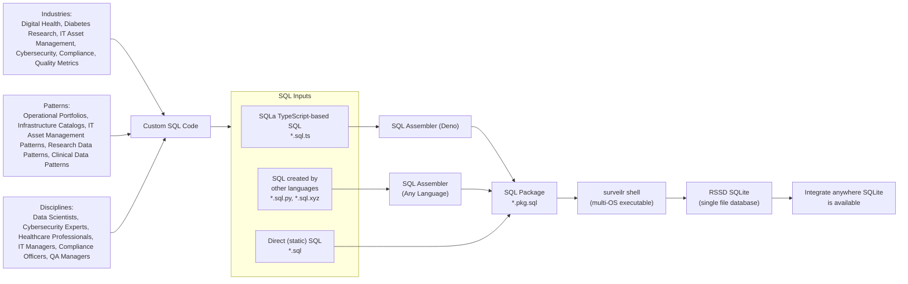

# `surveilr` SQL Packages

```mermaid
flowchart LR

%% Combine Industries, Patterns, and Disciplines into single boxes with their instances listed inside
IndustriesBox["Industries:
Digital Health, Diabetes Research, IT Asset Management, Cybersecurity, Compliance, Quality Metrics"]

PatternsBox["Patterns:
Operational Portfolios, Infrastructure Catalogs, IT Asset Management Patterns, Research Data Patterns, Clinical Data Patterns"]

DisciplinesBox["Disciplines:
Data Scientists, Cybersecurity Experts, Healthcare Professionals, IT Managers, Compliance Officers, QA Managers"]

%% Connect the combined boxes to SQL Inputs
IndustriesBox --> SQL_Inputs_Group["Custom SQL Code"]
PatternsBox --> SQL_Inputs_Group
DisciplinesBox --> SQL_Inputs_Group

%% Group for SQL input types
subgraph SQL_Inputs["SQL Inputs"]
    SQLa_Input["SQLa TypeScript-based SQL
      *.sql.ts"]
    CapExec_Input["SQL created by 
    other languages
      *.sql.py, *.sql.xyz"]
    Direct_SQL_Input["Direct (static) SQL
      *.sql"]
end

SQL_Inputs_Group --> SQL_Inputs["SQL Inputs"]

%% Process SQLa TypeScript SQL via SQL Assembler (Deno)
SQLa_Input --> SQL_Assembler_Deno["SQL Assembler (Deno)"]
CapExec_Input --> SQL_Assembler_Other["SQL Assembler
(Any Language)"]
SQL_Assembler_Deno --> SQL_Package["SQL Package"]
SQL_Assembler_Other --> SQL_Package["SQL Package"]

%% Direct SQL bypasses the assembler and goes directly to SQL Package
Direct_SQL_Input --> SQL_Package["SQL Package
*.pkg.sql"]

%% SQL Package flows into Surveilr Binary and RSSD Database
SQL_Package --> Surveilr_Binary["surveilr shell
(multi-OS executable)"]
Surveilr_Binary --> RSSD_DB["RSSD SQLite
 (single file database)"]

%% Portable output
RSSD_DB --> Target_System["Integrate anywhere SQLite
 is available"]
```
